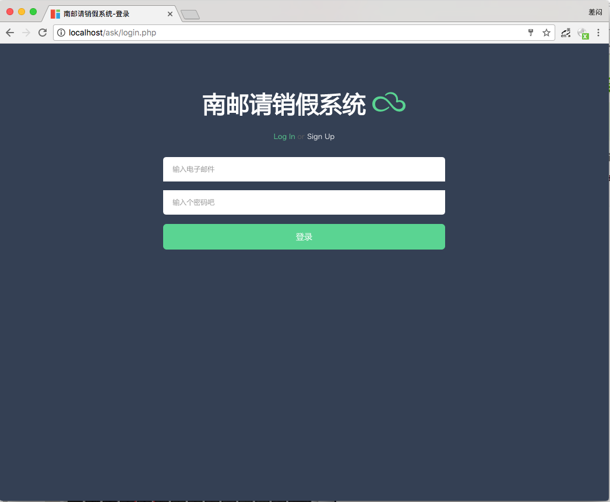
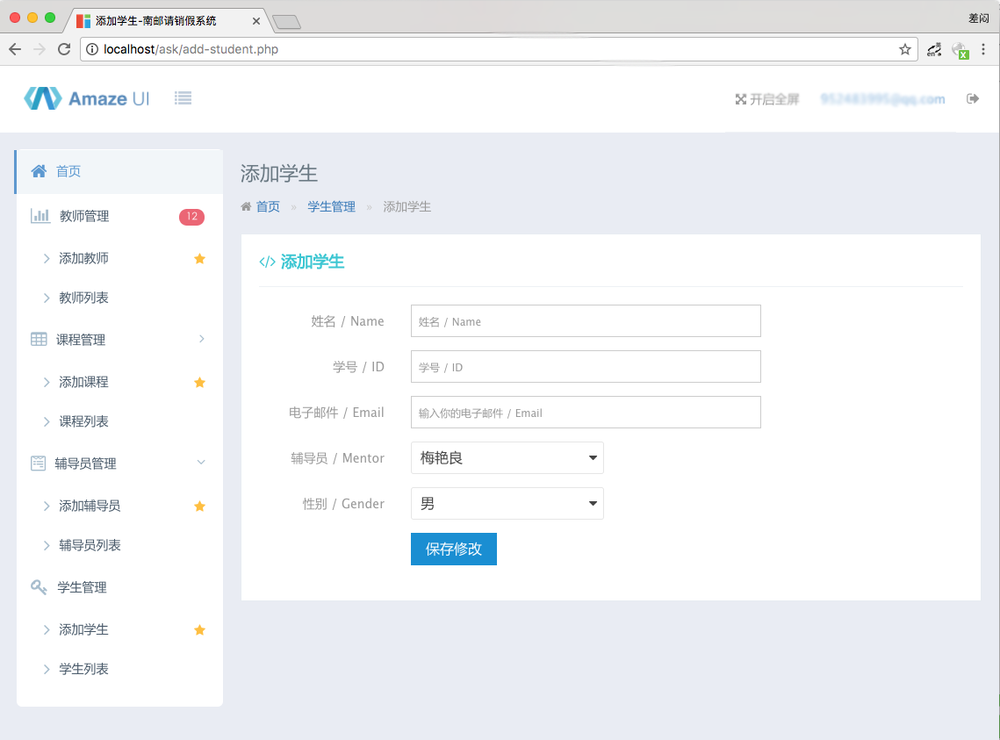
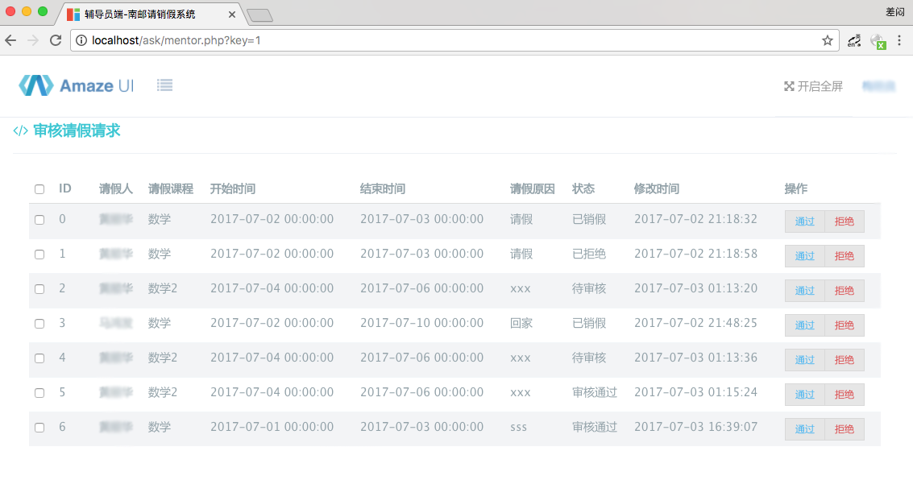
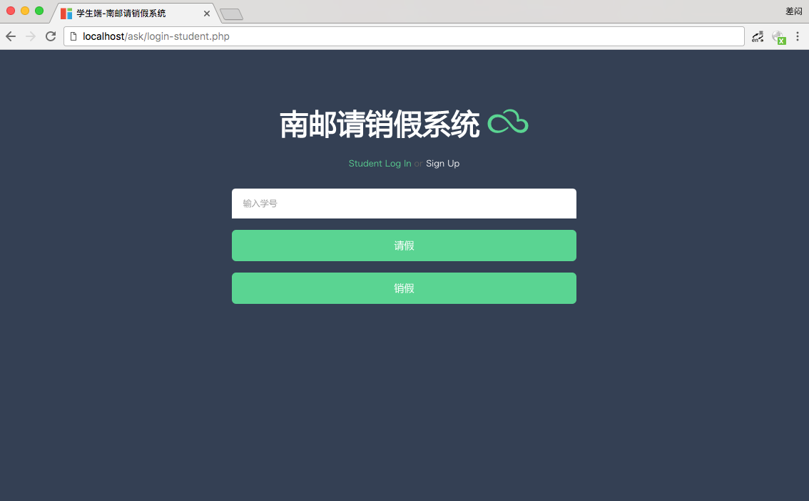
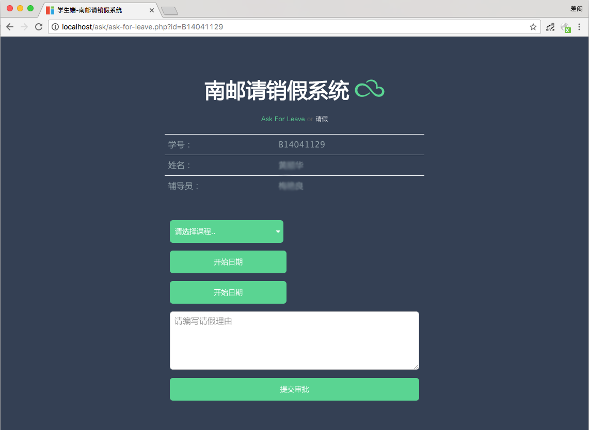
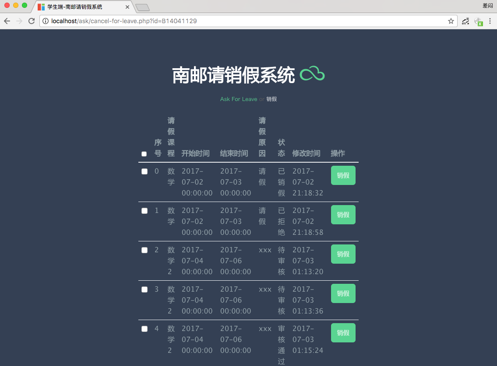

# 高校自动请销假系统

基于PHP、MySql、AmazeUI

## 需求 
请销假是学生的一项日常事务。 该系统实现了请销假的自助化。 管理员在系统中录入课程、教师、学生、辅导员信息。 学生在系统中提交请假申请。辅导员审批通过后,相应课程的教 师会收到请假通知。 学生归校后,提交销假申请。辅导员审批通过后,一次完整的请 销假完成。
辅导员可查看学生的请假记录。

## 安装
1. 编辑inc/config.php，修改数据库配置和smtp服务器配置
2. 执行askforleave.sql

## 入口
本系统分别为管理员、辅导员、学生三者提供了入口页面
管理员 /index.php 首页
 		--/add-teacher.php 添加教师
		--/add-class.php 添加课程
		--/add-mentor.php 添加辅导员
		--/add-student.php 添加学生
		--/list-teacher.php 管理教师信息
		--/list-class.php 管理课程信息
		--/list-mentor.php 管理辅导员信息
		--/list-student.php 管理学生信息

辅导员 /mentor.php?key=辅导员编号

学生   /login-student.php
		--/ask-for-leave.php 学生请假页面
		--/cancel-for-leave.php 学生销假页面

## 效果图

1.管理员登录页面

2.管理员-添加学生

3.辅导员审批页面

4.学生登录页面

5.请假页面

6.销假页面

